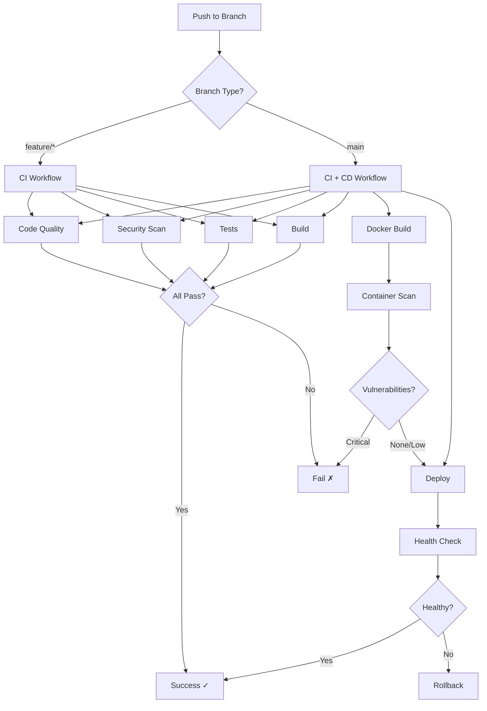

# Design Document - CI/CD & DevSecOps

## Overview

Sistema de CI/CD y DevSecOps implementado con GitHub Actions, optimizado para un solo desarrollador. El diseño prioriza automatización, feedback rápido y seguridad sin fricción, utilizando herramientas gratuitas y open source.

**Filosofía de Diseño:**
- **Shift Left Security**: Detectar problemas temprano en el ciclo de desarrollo
- **Fail Fast**: Fallar rápido en problemas críticos, warnings en menores
- **Automation First**: Automatizar todo lo repetitivo
- **Developer Experience**: No bloquear desarrollo innecesariamente
- **Zero Cost**: Solo herramientas gratuitas para repos privados

## Architecture

### High-Level Architecture

```
┌─────────────────────────────────────────────────────────────┐
│                    Developer Workflow                        │
│                                                              │
│  Local Dev → Commit → Push → GitHub → CI Pipeline           │
│                                  ↓                           │
│                            Pull Request                      │
│                                  ↓                           │
│                         CI/CD Workflows                      │
│                                  ↓                           │
│                            Merge to main                     │
│                                  ↓                           │
│                         Deployment Pipeline                  │
└─────────────────────────────────────────────────────────────┘

┌─────────────────────────────────────────────────────────────┐
│                    CI/CD Pipeline Stages                     │
│                                                              │
│  1. Code Quality     → Lint, Format, TypeCheck              │
│  2. Security         → SAST, SCA, Secrets                    │
│  3. Testing          → Unit, Integration, Coverage           │
│  4. Build            → Compile, Validate                     │
│  5. Container        → Docker Build, Scan                    │
│  6. Deploy           → Health Check, Rollback                │
└─────────────────────────────────────────────────────────────┘
```

### Workflow Orchestration



## Components and Interfaces

### 1. GitHub Actions Workflows

#### 1.1 CI Workflow (`ci.yml`)

**Trigger:** Push a cualquier rama, Pull Request a main

**Jobs:**
- `code-quality`: Linting, formatting, type checking
- `security`: SAST (CodeQL), SCA (npm audit), secret scanning
- `test`: Unit tests, integration tests, coverage
- `build`: Compilar backend y frontend

**Paralelización:**
```yaml
jobs:
  code-quality:
    runs-on: ubuntu-latest
  security:
    runs-on: ubuntu-latest
  test:
    runs-on: ubuntu-latest
  build:
    runs-on: ubuntu-latest
    needs: [code-quality, security, test]
```

#### 1.2 CD Workflow (`cd.yml`)

**Trigger:** Push a main (después de CI exitoso)

**Jobs:**
- `docker-build`: Construir imagen Docker
- `docker-scan`: Escanear vulnerabilidades con Trivy
- `deploy`: Deployment a staging/producción
- `health-check`: Verificar salud del servicio
- `rollback`: Rollback automático si falla

#### 1.3 Dependabot Workflow (`dependabot.yml`)

**Trigger:** Automático (diario)

**Configuración:**
- Escanear npm dependencies
- Crear PRs automáticos para actualizaciones
- Agrupar actualizaciones menores
- Priorizar actualizaciones de seguridad

#### 1.4 CodeQL Workflow (`codeql.yml`)

**Trigger:** Push a main, Pull Request, Schedule (semanal)

**Configuración:**
- Lenguajes: TypeScript, JavaScript
- Queries: security-extended
- Fail on: critical, high
- Warn on: medium, low

### 2. Security Components

#### 2.1 SAST (Static Application Security Testing)

**Tool:** GitHub CodeQL

**Configuration:**
```yaml
- name: Initialize CodeQL
  uses: github/codeql-action/init@v2
  with:
    languages: typescript, javascript
    queries: security-extended
    
- name: Perform CodeQL Analysis
  uses: github/codeql-action/analyze@v2
  with:
    category: "/language:typescript"
```

**Detection Rules:**
- SQL Injection
- XSS (Cross-Site Scripting)
- Path Traversal
- Command Injection
- Insecure Deserialization
- Hardcoded Credentials
- Weak Cryptography

#### 2.2 SCA (Software Composition Analysis)

**Tools:**
- `npm audit` (vulnerabilities)
- `license-checker` (license compliance)
- GitHub Dependabot (automated updates)

**Configuration:**
```yaml
- name: Audit Dependencies
  run: |
    npm audit --audit-level=high
    npm audit --json > audit-report.json
    
- name: Check Licenses
  run: |
    npx license-checker --summary
    npx license-checker --failOn "GPL;AGPL"
```

**Fail Conditions:**
- Critical vulnerabilities in dependencies
- High vulnerabilities in direct dependencies
- Incompatible licenses (GPL, AGPL)

#### 2.3 Secret Scanning

**Tools:**
- GitHub Secret Scanning (native)
- `trufflehog` (additional scanning)
- `gitleaks` (pre-commit hook)

**Configuration:**
```yaml
- name: Scan for Secrets
  uses: trufflesecurity/trufflehog@main
  with:
    path: ./
    base: ${{ github.event.repository.default_branch }}
    head: HEAD
```

**Detection Patterns:**
- AWS Keys
- API Tokens
- Private Keys
- Database Credentials
- JWT Secrets
- OAuth Tokens

### 3. Testing Components

#### 3.1 Test Execution

**Backend Tests:**
```yaml
- name: Run Backend Tests
  run: |
    cd apps/backend
    npm run test:ci
    npm run test:coverage
```

**Frontend Tests:**
```yaml
- name: Run Frontend Tests
  run: |
    cd apps/frontend
    npm run test:ci
    npm run test:coverage
```

#### 3.2 Coverage Reporting

**Tool:** Codecov (opcional) o GitHub Actions artifacts

**Configuration:**
```yaml
- name: Upload Coverage
  uses: codecov/codecov-action@v3
  with:
    files: ./coverage/lcov.info
    flags: backend
    fail_ci_if_error: false
```

**Thresholds:**
- Minimum: 70% overall
- Warning: < 80%
- Target: > 85%

### 4. Build Components

#### 4.1 Backend Build

**Steps:**
```yaml
- name: Build Backend
  run: |
    cd apps/backend
    npm run build
    npm run typecheck
```

**Validation:**
- TypeScript compilation successful
- No type errors
- Dist folder generated

#### 4.2 Frontend Build

**Steps:**
```yaml
- name: Build Frontend
  run: |
    cd apps/frontend
    npm run build
    npm run typecheck
```

**Validation:**
- Vite build successful
- No type errors
- Dist folder generated
- Assets optimized

### 5. Container Components

#### 5.1 Docker Build

**Dockerfile Strategy:**
- Multi-stage build
- Minimal base image (node:20-alpine)
- Non-root user
- Health check included

**Build Configuration:**
```yaml
- name: Build Docker Image
  run: |
    docker build -t ${{ env.IMAGE_NAME }}:${{ github.sha }} .
    docker tag ${{ env.IMAGE_NAME }}:${{ github.sha }} ${{ env.IMAGE_NAME }}:latest
```

#### 5.2 Container Scanning

**Tool:** Trivy

**Configuration:**
```yaml
- name: Scan Docker Image
  uses: aquasecurity/trivy-action@master
  with:
    image-ref: ${{ env.IMAGE_NAME }}:${{ github.sha }}
    format: 'sarif'
    output: 'trivy-results.sarif'
    severity: 'CRITICAL,HIGH'
    exit-code: '1'
```

**Scan Targets:**
- OS packages
- Application dependencies
- Known vulnerabilities (CVEs)
- Misconfigurations

### 6. Deployment Components

#### 6.1 Deployment Strategy

**Approach:** Blue-Green Deployment (simplified)

**Steps:**
1. Build new version
2. Deploy to staging slot
3. Run health checks
4. Switch traffic to new version
5. Monitor for errors
6. Rollback if needed

**Configuration:**
```yaml
- name: Deploy to Production
  run: |
    # Deploy new version
    docker-compose up -d --no-deps backend
    
    # Wait for health check
    sleep 10
    
    # Verify health
    curl -f http://localhost:3000/health || exit 1
```

#### 6.2 Health Checks

**Endpoint:** `/health`

**Checks:**
- Database connectivity
- Redis connectivity (if applicable)
- External API availability
- Memory usage
- Disk space

**Response Format:**
```json
{
  "status": "healthy",
  "timestamp": "2024-12-18T10:00:00Z",
  "checks": {
    "database": "ok",
    "redis": "ok",
    "memory": "ok"
  }
}
```

#### 6.3 Rollback Mechanism

**Trigger Conditions:**
- Health check fails after deployment
- Error rate > 5% in first 5 minutes
- Manual trigger

**Rollback Steps:**
```yaml
- name: Rollback on Failure
  if: failure()
  run: |
    docker-compose down
    docker-compose up -d --no-deps backend:previous
    curl -f http://localhost:3000/health
```

### 7. Branch Protection

**Configuration for `main` branch:**

```yaml
protection_rules:
  required_status_checks:
    strict: true
    contexts:
      - "code-quality"
      - "security"
      - "test"
      - "build"
  
  required_pull_request_reviews:
    required_approving_review_count: 0  # Solo dev
    dismiss_stale_reviews: true
  
  enforce_admins: false  # Permitir bypass para solo dev
  
  restrictions: null  # Sin restricciones de push
  
  required_linear_history: true
  
  allow_force_pushes: false
  
  allow_deletions: false
```

## Data Models

### 1. Workflow Configuration

```yaml
# .github/workflows/ci.yml
name: CI Pipeline
on:
  push:
    branches: ['**']
  pull_request:
    branches: [main]

env:
  NODE_VERSION: '20'
  PNPM_VERSION: '8'

jobs:
  code-quality:
    name: Code Quality
    runs-on: ubuntu-latest
    steps:
      - uses: actions/checkout@v4
      - uses: pnpm/action-setup@v2
      - uses: actions/setup-node@v4
      - run: pnpm install --frozen-lockfile
      - run: pnpm lint
      - run: pnpm format:check
      - run: pnpm typecheck
```

### 2. Security Scan Results

```json
{
  "scan_type": "SAST",
  "tool": "CodeQL",
  "timestamp": "2024-12-18T10:00:00Z",
  "results": {
    "critical": 0,
    "high": 2,
    "medium": 5,
    "low": 10
  },
  "vulnerabilities": [
    {
      "severity": "high",
      "rule": "sql-injection",
      "file": "src/user/repository.ts",
      "line": 45,
      "description": "Potential SQL injection vulnerability"
    }
  ]
}
```

### 3. Test Results

```json
{
  "test_suite": "backend",
  "timestamp": "2024-12-18T10:00:00Z",
  "summary": {
    "total": 150,
    "passed": 148,
    "failed": 2,
    "skipped": 0
  },
  "coverage": {
    "lines": 85.5,
    "branches": 78.2,
    "functions": 90.1,
    "statements": 85.5
  },
  "duration": "45s"
}
```

### 4. Deployment Metadata

```json
{
  "deployment_id": "deploy-123",
  "version": "v1.2.3",
  "commit_sha": "abc123",
  "deployed_by": "github-actions",
  "deployed_at": "2024-12-18T10:00:00Z",
  "environment": "production",
  "status": "success",
  "health_check": {
    "status": "healthy",
    "response_time": "150ms"
  }
}
```

## Correctness Properties

*A property is a characteristic or behavior that should hold true across all valid executions of a system-essentially, a formal statement about what the system should do. Properties serve as the bridge between human-readable specifications and machine-verifiable correctness guarantees.*

### Property 1: CI Pipeline Execution on Push
*For any* push to any branch, the CI pipeline should execute automatically within 5 minutes
**Validates: Requirements 1.1**

### Property 2: PR Validation Completeness
*For any* Pull Request to main, all required checks (code-quality, security, test, build) must pass before merge is allowed
**Validates: Requirements 1.2, 9.2**

### Property 3: Critical Vulnerability Blocking
*For any* security scan that detects critical vulnerabilities, the pipeline should fail immediately and prevent merge
**Validates: Requirements 2.2, 3.2**

### Property 4: Secret Detection Blocking
*For any* commit containing secrets (API keys, tokens, credentials), the pipeline should fail immediately and notify the developer
**Validates: Requirements 4.2, 4.3**

### Property 5: Test Execution Completeness
*For any* CI pipeline execution, all unit tests and integration tests should run and report results
**Validates: Requirements 5.1, 5.2**

### Property 6: Code Quality Enforcement
*For any* code that violates linting rules or has type errors, the pipeline should fail and prevent merge
**Validates: Requirements 6.4**

### Property 7: Branch Protection Enforcement
*For any* attempt to push directly to main, the system should reject the push and require a Pull Request
**Validates: Requirements 9.1**

### Property 8: Health Check Validation
*For any* deployment, the health check endpoint should return 200 status with valid response before marking deployment as successful
**Validates: Requirements 12.3, 12.5**

### Property 9: Deployment Rollback on Failure
*For any* deployment that fails health checks, the system should automatically rollback to the previous version
**Validates: Requirements 1.5**

### Property 10: SBOM Generation
*For any* successful CI pipeline execution, a Software Bill of Materials (SBOM) should be generated listing all dependencies
**Validates: Requirements 3.5**

### Property 11: Coverage Threshold Warning
*For any* test execution where coverage is below 70%, the system should generate a warning (but not fail the pipeline)
**Validates: Requirements 5.5**

### Property 12: Dependabot PR Creation
*For any* dependency update detected by Dependabot, an automated Pull Request should be created within 24 hours
**Validates: Requirements 3.3**

## Error Handling

### 1. Pipeline Failures

**Strategy:** Fail fast, provide clear feedback

**Error Categories:**
- **Critical**: Block merge, require fix (security vulnerabilities, test failures)
- **High**: Block merge, allow bypass with justification (linting errors)
- **Medium**: Warning, don't block (coverage below target)
- **Low**: Informational only (minor code smells)

**Error Response:**
```yaml
- name: Handle Failure
  if: failure()
  run: |
    echo "::error::Pipeline failed. Check logs for details."
    echo "::error::Failed step: ${{ steps.*.outcome }}"
    exit 1
```

### 2. Security Scan Failures

**Critical Vulnerabilities:**
```yaml
- name: Fail on Critical
  run: |
    if [ "$CRITICAL_COUNT" -gt 0 ]; then
      echo "::error::Critical vulnerabilities found: $CRITICAL_COUNT"
      echo "::error::Review security tab for details"
      exit 1
    fi
```

**Medium/Low Vulnerabilities:**
```yaml
- name: Warn on Medium/Low
  run: |
    if [ "$MEDIUM_COUNT" -gt 0 ]; then
      echo "::warning::Medium vulnerabilities found: $MEDIUM_COUNT"
    fi
```

### 3. Deployment Failures

**Health Check Failure:**
```yaml
- name: Check Health
  run: |
    for i in {1..5}; do
      if curl -f http://localhost:3000/health; then
        echo "Health check passed"
        exit 0
      fi
      echo "Health check failed, attempt $i/5"
      sleep 10
    done
    echo "::error::Health check failed after 5 attempts"
    exit 1
```

**Automatic Rollback:**
```yaml
- name: Rollback on Failure
  if: failure()
  run: |
    echo "::warning::Deployment failed, rolling back..."
    docker-compose down
    docker-compose up -d --no-deps backend:previous
    curl -f http://localhost:3000/health
    echo "::notice::Rollback completed successfully"
```

### 4. Retry Logic

**Network Failures:**
```yaml
- name: Install Dependencies
  uses: nick-invision/retry@v2
  with:
    timeout_minutes: 10
    max_attempts: 3
    command: pnpm install --frozen-lockfile
```

**Flaky Tests:**
```yaml
- name: Run Tests
  run: |
    npm run test:ci || npm run test:ci || npm run test:ci
```

## Testing Strategy

### 1. Workflow Testing

**Approach:** Test workflows locally before pushing

**Tool:** `act` (run GitHub Actions locally)

```bash
# Install act
brew install act

# Test CI workflow
act push -W .github/workflows/ci.yml

# Test with secrets
act push -W .github/workflows/ci.yml -s GITHUB_TOKEN=xxx
```

### 2. Security Testing

**SAST Testing:**
- Run CodeQL locally with CodeQL CLI
- Test with intentionally vulnerable code
- Verify detection of common vulnerabilities

**SCA Testing:**
- Add vulnerable dependency
- Verify npm audit detects it
- Verify pipeline fails

**Secret Scanning:**
- Commit test secret
- Verify detection
- Verify pipeline fails

### 3. Integration Testing

**End-to-End Pipeline Test:**
1. Create feature branch
2. Make code change
3. Push to GitHub
4. Verify CI runs
5. Create PR
6. Verify all checks pass
7. Merge to main
8. Verify CD runs
9. Verify deployment successful

### 4. Rollback Testing

**Scenario:** Deploy broken version

**Steps:**
1. Deploy version with failing health check
2. Verify automatic rollback
3. Verify previous version restored
4. Verify health check passes

### 5. Performance Testing

**Metrics to Track:**
- Pipeline duration (target: < 10 minutes)
- Cache hit rate (target: > 80%)
- Deployment time (target: < 5 minutes)
- Rollback time (target: < 2 minutes)

## Performance Optimizations

### 1. Caching Strategy

**Node Modules Cache:**
```yaml
- name: Cache Dependencies
  uses: actions/cache@v3
  with:
    path: |
      ~/.pnpm-store
      node_modules
      apps/*/node_modules
    key: ${{ runner.os }}-pnpm-${{ hashFiles('**/pnpm-lock.yaml') }}
    restore-keys: |
      ${{ runner.os }}-pnpm-
```

**Build Cache:**
```yaml
- name: Cache Build
  uses: actions/cache@v3
  with:
    path: |
      apps/backend/dist
      apps/frontend/dist
    key: ${{ runner.os }}-build-${{ github.sha }}
```

### 2. Parallel Execution

**Job Parallelization:**
```yaml
jobs:
  code-quality:
    runs-on: ubuntu-latest
  security:
    runs-on: ubuntu-latest
  test:
    runs-on: ubuntu-latest
  # All run in parallel
```

**Matrix Strategy:**
```yaml
strategy:
  matrix:
    node-version: [18, 20]
    os: [ubuntu-latest]
```

### 3. Conditional Execution

**Skip Unnecessary Steps:**
```yaml
- name: Run Backend Tests
  if: contains(github.event.head_commit.modified, 'apps/backend/')
  run: pnpm test:backend
```

**Skip on Draft PRs:**
```yaml
on:
  pull_request:
    types: [opened, synchronize, reopened, ready_for_review]

jobs:
  ci:
    if: github.event.pull_request.draft == false
```

### 4. Resource Optimization

**Use Smaller Runners:**
```yaml
runs-on: ubuntu-latest  # 2-core, 7GB RAM (free)
# vs
runs-on: ubuntu-latest-4-cores  # 4-core, 16GB RAM (paid)
```

**Optimize Docker Builds:**
```dockerfile
# Use build cache
FROM node:20-alpine AS builder
WORKDIR /app
COPY package*.json ./
RUN npm ci --only=production
COPY . .
RUN npm run build

# Minimal runtime image
FROM node:20-alpine
COPY --from=builder /app/dist ./dist
COPY --from=builder /app/node_modules ./node_modules
```

## Security Considerations

### 1. Secrets Management

**GitHub Secrets:**
- Store sensitive values in GitHub Secrets
- Never log secrets
- Use environment-specific secrets

**Secret Rotation:**
- Rotate secrets every 90 days
- Use short-lived tokens when possible
- Audit secret usage

### 2. Permissions

**Workflow Permissions:**
```yaml
permissions:
  contents: read
  security-events: write
  pull-requests: write
```

**Principle of Least Privilege:**
- Only grant necessary permissions
- Use read-only tokens when possible
- Limit scope of access tokens

### 3. Supply Chain Security

**Dependency Pinning:**
```yaml
- uses: actions/checkout@v4  # Pinned to major version
- uses: actions/setup-node@v4.0.0  # Pinned to exact version
```

**Verify Checksums:**
```yaml
- name: Verify Integrity
  run: |
    sha256sum -c checksums.txt
```

### 4. Audit Logging

**Track All Actions:**
- Who triggered workflow
- What changes were made
- When deployment occurred
- Why rollback was triggered

**Retention:**
- Keep logs for 90 days
- Archive critical events
- Enable GitHub audit log

## Monitoring and Observability

### 1. Pipeline Metrics

**Key Metrics:**
- Success rate (target: > 95%)
- Average duration (target: < 10 min)
- Failure rate by stage
- Time to recovery

**Dashboard:**
- GitHub Actions insights
- Custom badges in README
- Slack notifications (optional)

### 2. Security Metrics

**Track:**
- Vulnerabilities detected per week
- Time to remediation
- False positive rate
- Coverage of security scans

### 3. Deployment Metrics

**Track:**
- Deployment frequency
- Lead time for changes
- Mean time to recovery (MTTR)
- Change failure rate

### 4. Alerting

**Critical Alerts:**
- Pipeline failure on main
- Critical vulnerability detected
- Deployment failure
- Health check failure

**Warning Alerts:**
- Coverage below threshold
- Medium vulnerabilities
- Slow pipeline (> 15 min)

## Documentation

### 1. README Badges

```markdown


```

### 2. Workflow Documentation

**Location:** `.github/workflows/README.md`

**Content:**
- Purpose of each workflow
- Trigger conditions
- Required secrets
- Troubleshooting guide

### 3. Runbook

**Location:** `docs/runbook.md`

**Sections:**
- How to trigger manual deployment
- How to rollback
- How to bypass checks (emergency)
- Common errors and solutions

## Migration Plan

### Phase 1: Foundation (Week 1)
- Setup GitHub Actions
- Configure branch protection
- Enable Dependabot
- Enable GitHub Secret Scanning

### Phase 2: CI Pipeline (Week 2)
- Implement code quality checks
- Implement security scanning (CodeQL)
- Implement testing
- Implement build validation

### Phase 3: CD Pipeline (Week 3)
- Implement Docker build
- Implement container scanning
- Implement deployment automation
- Implement health checks

### Phase 4: Optimization (Week 4)
- Add caching
- Optimize parallel execution
- Add monitoring
- Document everything

## Conclusion

Este diseño proporciona un sistema completo de CI/CD y DevSecOps optimizado para un solo desarrollador, balanceando seguridad, automatización y experiencia de desarrollo. La implementación es incremental, permitiendo valor desde la primera fase mientras se construye hacia un sistema completo y robusto.
